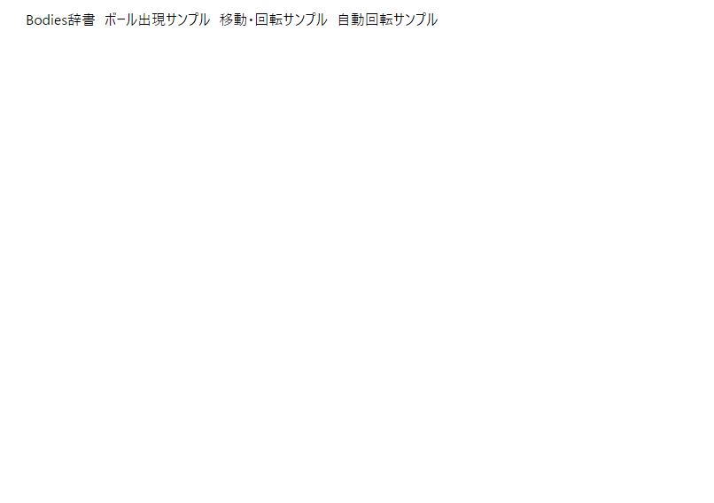

# matter.jsサンプルプロジェクト
[matter.js](https://brm.io/matter-js/)をみながら動作確認及び色々やる試験プロジェクトです。
Reactを使用しています。

# 環境
- Node.js v21.5.0
- [Create React App](https://create-react-app.dev/)で作成
- yarn v4.0.2
- React v18.2.0

その他追加パッケージは`package.json`参照してください。


# セットアップ
`yarn`を利用しています。まずパッケージをインストールしましょう。
```bash
yarn install
```
次に、環境変数を用意します。
`.env.local`ファイルを作成し下記を入力します。
```shell
REACT_APP_SERVER_URL=http://localhost:3001
```

## クライアントローカルサーバ起動
以下のコマンドでクライアント側のサーバーを起動できます。
[http://localhost:3000/](http://localhost:3000/)
```bash
yarn start
```
下記画面になれば完了です（2024/02/08現在）


## サーバーローカルサーバー起動
以下コマンドでサーバー側のサーバーを起動できます。
ポート番号は3001にしてあります。Expressを利用。
```bash
yarn node server/server.js
```